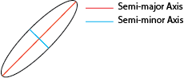

.. appendix1

==========
Appendix 1
==========

.. _app-distance_matrix:

**Distance Matrix**: A dense matrix that stores the distance between each point observation and the *k*-nearest neighbors.  Because the matrix is dense it is computationally expensive to populate all distances and prohibitive to store the entire matrix, in memory, for a large number of observations.

.. _app-ellipticity:
   
**Ellipticity**: 'Flattening is a measure of the compression of a circle or sphere along a diameter to from an ellipse.' [wiki2013flattening]_  This is expressed as:

:math:`\frac{1}{f}`, where
   
:math:`f=\frac{a-b}{a}`, where
   
*a* is the semi-minor axis of the ellipsoid and *b* is the semi-major axis of the ellipsoid.

.. _app-geodesic:

**Geodesic Distance Measurement**: TODO

.. _app-planar:

**Planar Distance Measurement**: TODO

Citations:
----------
.. [wiki2013flattening] Wikipedia (2013). Flattening. https://en.wikipedia.org/wiki/Flattening