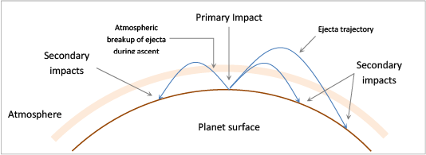

.. intro

------------
Introduction
------------

The USGS Large Crater Cluster (LCC) Tool is a series of ArcMap tools designed to analyze the spatial distribution of secondary craters to assist in the identification of one or more potential source craters.  This tool was designed to be run using digitized secondaries (points), bounding ellipsoids around visually identified craters (polygons), or best fit lines through visually identified clusters (polylines).

Background
----------
Originally released in XXXX by Skinner and Nava for ArcGIS 9.3, the tool was designed to work with a single body, Mars.  The tool saw use in the analysis of point secondaries around Zunil crater and can be referenced by the following papers and abstracts.

1. P1
2. P2
3. P3

Tool Concepts
-------------

The LCC Suite is designed to work sequentially, using the output from each tool as the input for the next processing step.  In total, LCC requires five processing steps, each with a range of parameters.  The tool is designed to allow for iterative parameter exploration at each processing step and a single, five step run is unlikely as parameters are dataset specific.  

The process of potential source crater identification begins with a digitized shapefile or featureclass of secondary craters.  First, a truncated :ref:`distance matrix <app-distance_matrix>` is generated in tabular form to both reduce later processing times and begin to generate descriptive statistics about the dataset.  Next, individual secondary impacts are clustered using either a heirarchal clustering method or a density based clustering method.  The directional distribution and :ref:`ellipticity <app-ellipticity>` of each statistically signifigant cluster is then computed.  Each cluster is then represented as either a bounding ellipsoid or a single line along the semi-major axis.  Using this line, the tool then extends a trajectory line, to a user defined distance.  Finally, the intersetion of all trajectory lines are computed and clusters of intersecting lines assigned a single weighted, or unweighted, centroid point.

The processing steps assume that noise exists in the digitized data due to secondaries that do not cluster and clusters that intersect in areas without any clear primary.  Therefore, at each step the tool seeks to reduce the total sample size based on distance, flattening, length or other parameters and reduce the overall impact of noise.

Updated Functionality
----------------------
The updated version of the tool retails all of the existing functionality and adds the following:

- The generation of a truncated distance matrix in tabular form to avoid duplicate processing during iterative tool use.
- The addition of a new clustering method, DBScan, that improves tool runtime and accounts for density in the generation of clusters.
- The paramaterization of the number of standard deviations at which bounding ellipsoids and semi-major axes are computed.  
- Computation of a weighted inverse flattening at each trajectory intersection that allows for the computed secondary intersection centroid to be weighted towards the most likely trajectory intersections.
- The ability to utilize the tool with both point secondaries and polyline digitizations of secondaries.  This allows for users to supply a best fit line through a series of points and skip the automated computation of clusters.
- The ability to aggregate disparate semi-major axis approximations (derived from bounding ellipsoids or digitized as best fit lines) into a single trajectory approximation processing step.  This allows multiple shapefile or featureclasses to be generated and analyzed as a single dataset without merging prior to analysis.
