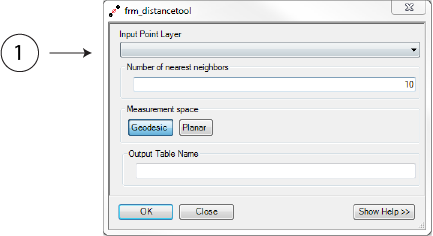
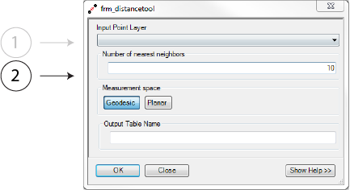
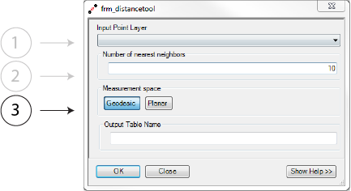
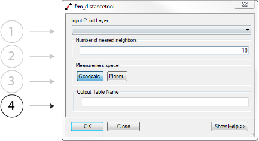

.. distance_tool

---------------------
Distance Matrix Tool
---------------------

Overview
+++++++++
This tool computes the distance between each secondary and its *k* nearest neighbors and stores them as a truncated :ref:`distance matrix <app-distance_matrix>`.

.. image:: ../images/ch4_distance/form.png

This is the first processing step and is required for all input datasets stored as points. 

Parameters
++++++++++

Input Point Layer
~~~~~~~~~~~~~~~~~

The *Input Point Layer* can be any shapefile or featureclass with the point geometry type.  

.. note:: 
   It is not possible to use shapefiles or featureclasses with the multipoint type.

Number of Nearest Neighbors
~~~~~~~~~~~~~~~~~~~~~~~~~~~

The *Number of nearest neighbors* is any integer greater than 0 and less than the total number of observations.  This number dictates the number of nearest neighbors to which the distance is stored.  For example, when *k* equals 5 the 5 nearest neighbors to each observations will be stored.  The larger *k* is the longer total runtime will be.

Measurement Space
~~~~~~~~~~~~~~~~~

The *Measurement Space* parameters indicates where the distance between two observations is compute in :ref:`planar <app-planar>` or :ref:`geodesic <app-geodesic>` space.  The former is faster, but less accurate over large distances.

.. warning::
  The error associated with planar distance computation over large distances on a spheroid can be signifigant.  This processing steps occurs once, and we suggest that you use geodesic distance measures unless you have a compelling reason not to.

Output Table Name
~~~~~~~~~~~~~~~~~

The *Output Table Name* is the user defined named for the output table.  The tool checks for valid output names.  The output is saved in the same directory or geodatabase that the input shapefile or featureclass, respectively, reside in.  
   

Rationale
++++++++++
A key component of many spatial analysis tasks requires knowing the distance between one or more observations.  Traditionally, this information is either computated while the algorithm runs or stored in a :ref:`distance matrix <app-distance_matrix>`.  The former lengths run times are the computation is O(n^2) and the later requires that O(n^2) memory be available to store a dense matrix of observations.

We seek to overcome the inherent speed decrease by pre-computing a distance matrix to be used in alter steps.  This allows for iterative parameter exploration without paying an added computational cost with each iteration.  To overcome the memory issues, we store the distance matrix in the `.dbf` table form used by ArcGIS.

