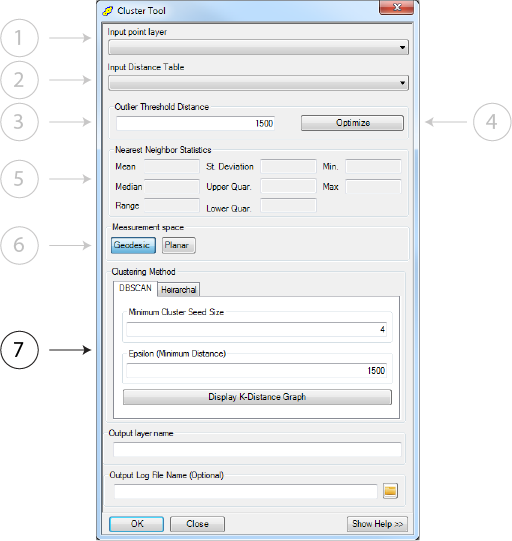

.. cluster_tool

------------
Cluster Tool
------------

Overview
++++++++

.. image:: ../images/ch5_cluster/form.png

This tool attempts to statistically cluster individual point seconadries using one of two methods: DBScan or Classic Hierarchical.  The goal of this phase is to process a large number of raw data points and group them based on their spatial distribution. 

.. note:: 
   This phase seeds all further phases and the exploration of parameters with a specific dataset is suggested because the mathematical identification of clusters is quite dependent on the constrains imposed by the selected parameters, i.e. threshold distance or minimum cluster size.

Parameters
++++++++++

Input Point Layer
~~~~~~~~~~~~~~~~~

The *Input Point Layer* can be any shapefile or featureclass with the point geometry type.  

.. note:: 
   It is not possible to use shapefiles or featureclasses with the multipoint type.

Input Distance Table
~~~~~~~~~~~~~~~~~~~~

The *Input Distance Table* is derived using the previous processing step.  This table is used in the optimization of input parameters.

.. warning::
   The input distance table should have been computed in the same measurement space that is being used in this processing phase or the optimized parameter computation will **not** be accurate.
  
  
Outlier Threshold Distance
~~~~~~~~~~~~~~~~~~~~~~~~~~

 
The *Outlier Distance Threshold* is the distance beyond which points are automatically designated as noise and removed from the dataset prior to processing.  For example, if the outlier distance threshold equals 1500 and a secondary has not neighbors within that distance, it is removed from the dataset for processing.  This reduces the total data size and speeds processing at the cost of potentially missing clusters at a smaller (i.e. greater distances between points) scale.
 
Optimization
~~~~~~~~~~~~~

Optimization seeks to provide a best guess estimate of the outlier threshold distance, the value of *Epsilon* if DBScan is to be used, and populates the *Nearest Neighbor Statistics*.  The goal of optimization is to begin to focus the parameter search and identify a range of values that may mathematically yield clusters as visually identified.

Nearest Neighbor Statistics
~~~~~~~~~~~~~~~~~~~~~~~~~~~

*Nearest Neighbor Statistics* reports descriptive statistics based on the *Input Distance Table*.  The optimal values for this tools parameters are undoubtably dataset specific, but the reported descriptive statistics can assist in parameterizing this tool.

Measurement Space
~~~~~~~~~~~~~~~~~

The *Measurement Space* parameters indicates where the distance between two observations is compute in :ref:`planar <app-planar>` or :ref:`geodesic <app-geodesic>` space.  The former is faster, but less accurate over large distances.

.. warning::

   The error associated with planar distance computation over large distances on a spheroid can be significant.  This processing steps occurs once, and we suggest that you use geodesic distance measures unless you have a compelling reason not to.
  
  
Clustering Method
~~~~~~~~~~~~~~~~~

The *Clustering Method* is the underlying mathematical algorithm that determines which secondaries are noise and which can be assigned to one or more clusters.  Two options for clustering are:

DBScan
^^^^^^^
DBScan is a density based scan that is ideal for datasets with varying point distribution densities, an unknown number of classes (clusters), and an unknown distance threshold.  This is because DBScan derives clusters based upon the distance between neighbors and the density of neighbors to one another.  Additionally, DBScan is computational more efficient that a Hierarchical clustering.

DBScan Parameters
#################

**A**: Minimum Cluster Seed Size
This is minimum number of neighbors a point must have within the minimum distance in order to being generating a cluster.  Generally this should be one plus the dimensionality of the dataset (1 + d) or 4.  Whichever is greater.

.. note::
   Running DBScan with this parameter equal to 2 is essentially the same as performing a Hierarchical clustering.

**B**: Epsilon (Minimum Distance)
This is the distance at which a cluster can be identified, i.e. points beyond this distance from another point are not adjacent neighbors within a cluster.  It is possible that the cluster extends to many points beyond epsilon, but the nearest neighbor to any point within a cluster will always be within the minimum distance parameter.

**C**: K-Distance Graph
The K-Distance graph provides a metric to assist in computing |epsi|.  |epsi| is used to remove noise that may interfere with the generation of a cluster.  Therefore, this graph shows the distance between a source point and the *k* farthest point away, where *k* is the current minimum cluster seed size parameter.  Noise can be visually identified at the point where the charted line's slope increases dramatically.

.. note:: The generation of this graph requires that the distance table have as many entries as *k*, i.e. if *k* equaled 5 in the previous step, it is not possible to accurately compute a *k*-distance graph with *k* = 7 in this step.

.. warning:: The *k*-distance graph is a metric only and the results must be rectified with domain area knowledge and an understanding of the input data.  For example, we see signifigant banding using secondaries digitized from CTX imagery that skews the *k*-distance graph to indicate |epsi| distances that correspond with edges of the individual images.

How DBScan Works
################
The following describes a 'toy' iteration of DBScan and illustrates the underlying process by which points are clustered.

1. Randomly select a single point from the pool of points.  Count the number of neighbors within Epsilon.  If the number of neighbors is greater than the minimum cluster seed size, start a new cluster.  Otherwise, mark the point as noise.

   An initial point is selected, but with a minimum seed size equal to 4, is marked as noise.  This point has only 3 neighbors within |epsi|.

2. Randomly selection another point and repeat setting points as noise until a cluster is generated.

   
   In the previous steps points 1 and 2 were marked as noise.  Next point 3 was randomly selected.  This point fulfills the minimum distance criteria and a new cluster is created.  All points within |epsi| of point 3 are added to the cluster.
   
3. Iterate over each unvisited point in the newly formed cluster and check to see if either points previously marked as noise are part of the cluster, or unvisited points can be added to the cluster.

   
   Upon visiting point 4, point 1, previously marked as noise is added to the growing cluster.  This is because it fulfills the minimum cluster seed size criteria for point number 4.  It is possible that a point fails the minimum cluster size criteria when the |epsi| distance is centered on it, but passes when centered on a neighbor.
   
4. Continue to grow a cluster until no remaining points that fulfill both constrians remain.  
5. Remove the cluster from the point dataset.

.. note:: 
   Step 5 provides a major speed improvement because the total number of points, queried for neighbors, decreases as clusters are identified.  We can assert that once a cluster is formed, the points that comprise said cluster can not be members in another cluster.

Hierarchical
^^^^^^^^^^^^^
This tool provides an divisive hierarchical clustering algorithm that seeks to identify small clusters (an individual observation initially) and merge them into progressively larger clusters.  This method visits each point individually and queries its memebership in an existing sub-cluster.  If the point is a member of a sub-cluster a local search is performed to visit all other cluster within *D*, a predetermined distance.  All points that fall within that distance from another member of the sub-cluster are removed from the primary cluster (the global dataset).

Hierarchical Parameters
#######################

**A**: Cluster Distance
The fixed distance beyond which a point can not be clustered to another point.  For example, if the fixed distance is 1500m and a point is within 1500m of another point, the two are clustered.

**B**: Buffer Options
While not physically buffering the points, the buffer options all duplicate the process by which buffers at a fixed distance *D* would be created and then intersected to create a cluster.  Using the example above, each point would be buffered to *D* and if the buffers spatially intersected they would be considered part of the same cluster.  *D* can be defined in one of three ways:

1. *Nearest Neighbor Distance* - *D* equals the nearest neighbor distance computed for each point.
2. *Nearest Neighbor Distance x* - The nearest neighbors distance times some user defined constant.
3. *Fixed Distance* - The fixed distance (in meters) times 2, to represent a buffer with radius equal to *d*.

.. note::
   This parameter is generally left unset as the *Outlier Distance Threshold Parameter* provides a mean to reduce the overall dataset size through noise identification.  It is possible though to set the *Outlier Distance Threshold Parameter* to a 

How Hierarchical Clustering Works
##################################
As above, the following is a 'toy' representation of how hierarchical clustering functions.

1. Assume that all points are part of a single cluster, i.e. the entire dataset is one cluster.
2. Set *D* to fixed distance.

.. note::
   Defining *D* using a different method does not alter the algorithm flow.

   
   *D* is defined as some integer value
   
3. Select a starting point (in this case the first point by OID or FID).

   
   Point 1 and its nearest neighbor are assigned to a cluster.  Not other points fall within *D* of point 1.
   
4. Select the next point in the list, and check for all neighbors.

   
   Point 2 is selected and a new cluster formed from all points within *D* of point 2.
   
5. Continue selecting points until all points in the dataset have been visited.  When a point with a previously assigned cluster is visited, it is possible for smaller clusters to merge to form larger clusters.  For example:

   
   Point 3 is already assigned to the red cluster.  It is visited for the first time and has a neighbor, within *D*, that is part of the green cluster.  These clusters will now merge into a single larger cluster.

Output Layer Name
~~~~~~~~~~~~~~~~~

The output file name.  This file is created in either the same directory as the input file or in the geodatabase in which the input featureclass resides.

Output Log File
~~~~~~~~~~~~~~~~~

A log file to write processing steps and statistics to.  

..note:: If tracking an iterative run of the tools, we suggest placing all of the sequentially generated logs in one file or using a standard naming convention.  We are unable to dynamically link logs as tool parameters can change between iterations.

Rationale
+++++++++
The ideal identification of clusters would occur visually as it is not possible to computationally identify each and every ideal cluster in a large dataset.  Conversely, it is not possible to manually identify all of the ideal clusters in a reasonable amount of time with 100% certainty (due to digitization errors, misinterpretation, etc.)  Therefore, the mathematical clustering provided seeks to provde a best guess cluster.

It is imperative that the results of any clustering be analyzed.  Do the clusters make sense in this usage domain?  Are the clusters distributed along track?  Is the data skewed due to digitization prior to clustering?  What facts are driving parameter selection and how are the distance or densities driving clustering?

In practice we find that DBScan is signifigantly faster than hierarchical clustering.  On a 20,000 observation dataset we see a speedup of approximately 7 times using the default parameters.  Again, unless you have a compelling reason to utilize hierarchical clustering, we suggest initially using DBScan. 

.. |epsi|   unicode:: U+003F5 .. GREEK LUNATE EPSILON SYMBOL