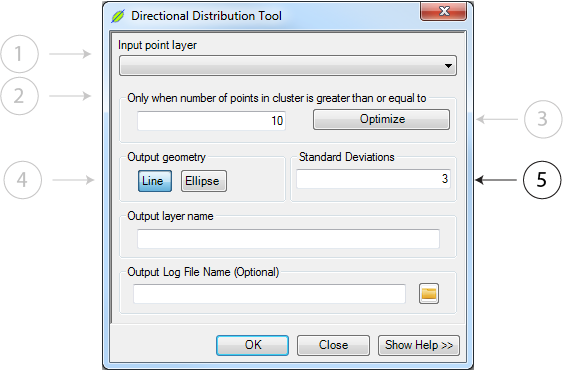

.. direction_tool

-----------------------------
Directional Distribution Tool
-----------------------------

Overview
++++++++

This tool iterates over each of the identified clusters (from the previous step) and computes a bound ellipsoid.  The geometry and directionality of the bounding ellipsoid are then stored as an output shapefile or featureclass and used in the next processing step.

Paramaters
+++++++++++

Input Point Layer
~~~~~~~~~~~~~~~~~

The *Input Point Layer* can be any shapefile or featureclass with the point geometry type and a clusterID field.

Minimum Cluster Size
~~~~~~~~~~~~~~~~~~~~

All clusters under this size will note be analysed for the directional distribution.  If you wish to use all clusters, enter a value equal to or less than the minimum cluster size.

.. note::
   If you used DBScan in the previous step, the minimum cluster size is the value selected for the *Minimum Cluster Seed Size*.  If you used hierarchical clustering, simply open the layer's attribute table and sort the *cnt* field ascending to see the minimal cluster size.

Optimize
~~~~~~~~

We populate the *Minimum Cluster Size* with our best guess number of cluster points in order to reduce the overall data size.

Output Geometry
~~~~~~~~~~~~~~~

This option is largely representational.  The directionality and ellipticity of each cluster can be visualized as either a bounding ellipse or a single line that bisects the cluster along the semi-major axis of the bounding ellipse.

Standard Deviations
~~~~~~~~~~~~~~~~~~~

The number of standard deviations out which to draw the bounding ellipse and compute the ellipticity statistic.

   
   Varying the number of standard deviations alters the fit of the ellipsoid to the cluster.  This alters the length of the semi-major and semi-minor axis, but not the :ref:`ellipticity <app-ellipticity>`

Output Layer Name
~~~~~~~~~~~~~~~~~

The output file name.  This file is created in either the same directory as the input file or in the geodatabase in which the input featureclass resides.

Output Log File
~~~~~~~~~~~~~~~~~

A log file to write processing steps and statistics to.  

..note:: 
   If tracking an iterative run of the tools, we suggest placing all of the sequentially generated logs in one file or using a standard naming convention.  We are unable to dynamically link logs as tool parameters can change between iterations.

Rationale
+++++++++
Sourcing primary impacts from secondaries requires that the potential trajectory of a cluster of secondaries be computed.  In practice, we see that the :ref:`ellipticity <app-ellipticity>` of a cluster directly impacts the confidence with which we can assign a primary impact location.  That is, the more ellipticial a chain of seconadaries is, the more confident we are in the approximate trajectory of the material.  Therefore, we can be more confident that the source lies somewhere along said trajectory.