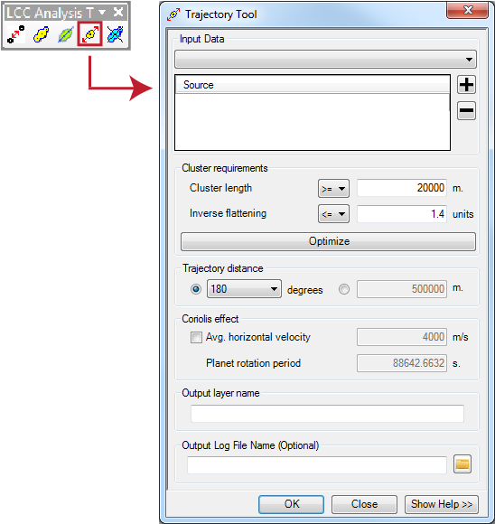
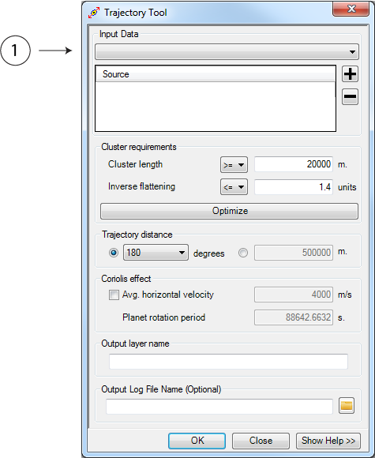
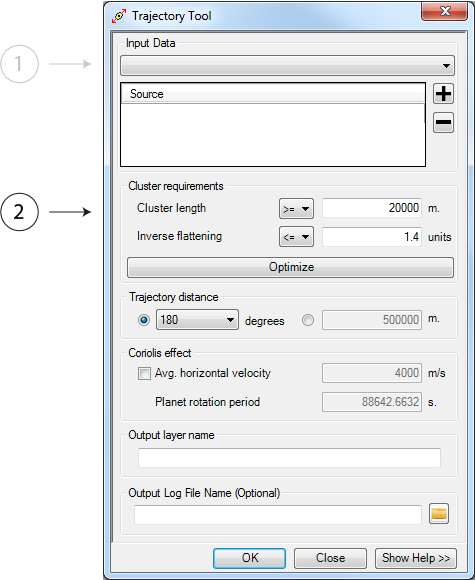
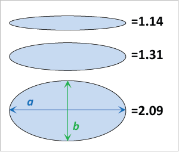
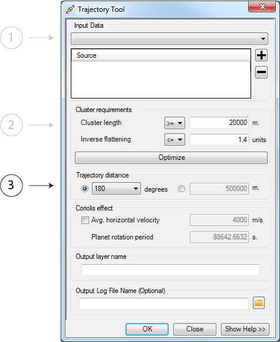
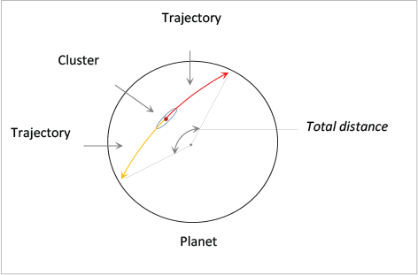
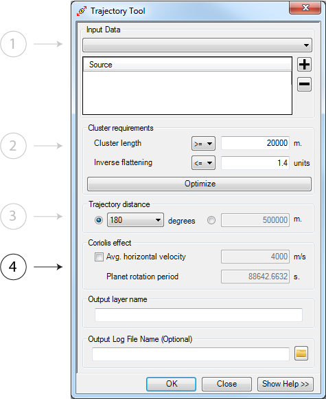
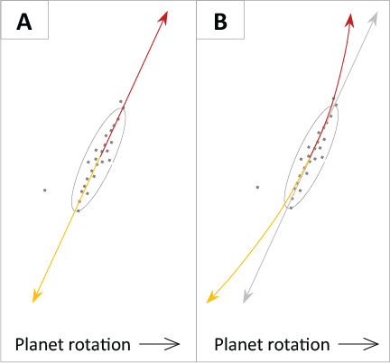
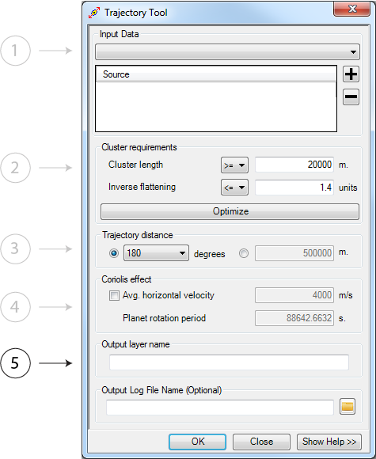
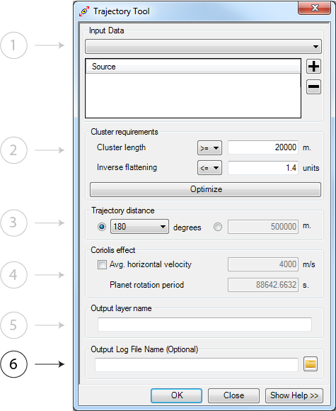

.. trajectory_tool

---------------
Trajectory Tool
---------------

Overview
+++++++++

The trajectory approximation tool extends trajectory lines from the semi-major start and end points along geodesic (great circle) trajectories to either a user defined distance or a fixed number of degrees.

Parameters
+++++++++++

Input Data
~~~~~~~~~~~

One or more directional distribution files.  These can be polyline or polygon shapefile files or featureclasses.  It is now possible to enter more than one shapefile or featureclasses.  The tool merges the input datsets in memory and processes them as if they were a single input dataset.  This is ideal for datasets generated by multiple users over a large geographic area or for multiple disparate iterations of previous steps (e.g. one iteration with a small minimum distance and one iteration with a large minimum distance using the same input point secondary file.)

.. warning::
   All shapefiles or feartureclasses *must* be in the same coordinate system.
   
Cluster Requirements
~~~~~~~~~~~~~~~~~~~~

Again, this tool seeks to reduce the overall dataset size and remove outliers (noise) from the dataset.  The following parameters assist in reducing dataset size:

1. *Cluster Length* - Cluster greater than or equal to or less than or equal to this value will be omitted from trajectory extension
2. If the input shapefile or feature class was processed using this tool from the computation of a Distance Table onward, it will have an inverse flattening field.  This field can be use to further remove those clusters with an ellipticity less than some threshold.

For example:

   
   Example inverse flattening values and the shape of the bounding ellipsoids.  

Optimization seeks to find appropriate starting parameters given the length and, if available, inverse flattening attributes of the input features.

Trajectory Distance
~~~~~~~~~~~~~~~~~~~~

The total distance to which the trajectories are extended in either direction from the centroid of the directional distribution line or the centroid of the digitized line after it is projected into geodesic space (e.g. curved to the spheroids shape).

   
   The *Trajectory Distance* indicates the total distance travelled from one end of a trajectory to another.  Therefore, the total distance travelled in one direction is equal to 1/2 the input value.  For example, if the *Total Distance* is 180 degrees, the trajectory is extended 90 degrees in each direction.

Coriolis Effect
~~~~~~~~~~~~~~~

This parameter indicates whether the rotation of the body (coriolis effect) should be accounted for when projecting the trajectory lines.

   
   When the coriolis effect is applied to the trajectory computations each vertex that comprises the polyline (shown in A) will eb shifted based on the input *Average ejecta velocity* and the rotation of the planet.
   
Output Layer Name
~~~~~~~~~~~~~~~~~

The output file name.  This file is created in either the same directory as the input file or in the geodatabase in which the input featureclass resides.

Output Log File
~~~~~~~~~~~~~~~~~

A log file to write processing steps and statistics to.  

..note:: 
   If tracking an iterative run of the tools, we suggest placing all of the sequentially generated logs in one file or using a standard naming convention.  We are unable to dynamically link logs as tool parameters can change between iterations.
   

