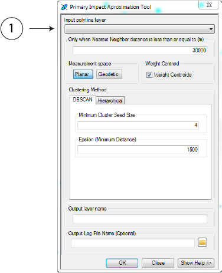
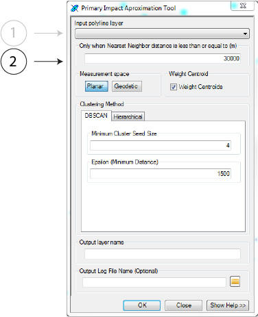
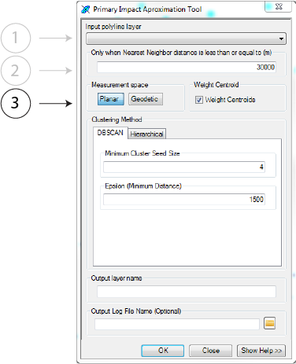
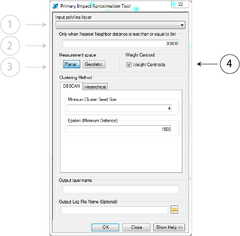
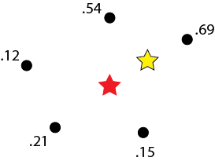
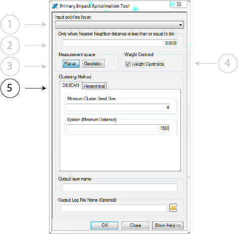

.. impact_tool

---------------------------------
Primary Impact Approximation Tool
---------------------------------

Overview
+++++++++++
.. image::  ../images/ch8_piat/form.png

This tool intersects trajectories, computed in the previous phase, clusters those intersections into statistically signifigant clusters, and then locates the centroid of each cluster.  This centroid is an approximation of the mean intersection of all pairs of itnerscting trajectories.

Parameters
++++++++++++

Input Polyline Layer
~~~~~~~~~~~~~~~~~~~~

A single shapefile or featureclass of trajectories, generated using the previous tool.

Nearest Neighbor Distance	
~~~~~~~~~~~~~~~~~~~~~~~~~

As with the clustering tool.  This is the distance beyond which intersection points will be considered noise and discarded.  This is particularly helpful when using long trajectories that may intersect in multiple places, one of which is far from an anticipated primary impact location.  In practice these are generally isolated intersections far from other intersections within the dataset.

Measurement Space
~~~~~~~~~~~~~~~~~

The *Measurement Space* parameters indicates where the distance between two observations is compute in :ref:`planar <app-planar>` or :ref:`geodesic <app-geodesic>` space.  The former is faster, but less accurate over large distances.

.. warning::

   The error associated with planar distance computation over large distances on a spheroid can be significant.  This processing steps occurs once, and we suggest that you use geodesic distance measures unless you have a compelling reason not to.

Weighted Centroid
~~~~~~~~~~~~~~~~~

If the input shapefile or featureclass has an iflat (inverse flattening) field, it is possible to compute the weighted centroid of each itnersection cluster.  We compute the weighted centroid as

:math:`\frac{1}{l_{1} * l_{2}}`, where

:math:`l_{1}` is the first trajectory and :math:`l_{2}` is the second trajectory.

   
   A trivial example of weighted (yellow) vs. unweighted (red) centroid.  By weighting the centroid computation the approximate primary impact is 'pulled' towards trajectory intersections with an inverse product ellipticity closer to 1 (the ideal inverse flattening flat).

   
Clustering Method
~~~~~~~~~~~~~~~~~

As with the clustering tool, it is possible to cluster the point intersections using either :ref:`DBScan <dbscan>` or :ref:`hierarchal <hierarchical>` clustering methods.  Please see the documentation on that page as the parameters, underlying algorithm, and rationale for application are the same.

Output Layer Name
~~~~~~~~~~~~~~~~~

The output file name.  This file is created in either the same directory as the input file or in the geodatabase in which the input featureclass resides.

Output Log File
~~~~~~~~~~~~~~~~~

A log file to write processing steps and statistics to.  

..note:: 
   If tracking an iterative run of the tools, we suggest placing all of the sequentially generated logs in one file or using a standard naming convention.  We are unable to dynamically link logs as tool parameters can change between iterations.

Rationale
++++++++++
This tool functions by assessing the quantity of intersections within a given geogramic region.  We assume that a higher number of intersecting seconadry crater elliposid trajectories is indicative of a *potential* source crater.  It is important to state that some primary impact craters will be sourced to areas where a primary impact clearly did not occur.  This highlights the importance of decreasing dataset size through the reduction of noise, i.e. the continuious increase in constrain as each tool is run in sequence.

As stated previously we also suggest that a lower inverse flattening (closer to 1) suggests a cluster with stringer pointing.  Therefore, we include a ability to weight the centroid of clustered intersections towards those intersections with the highest weightings. 